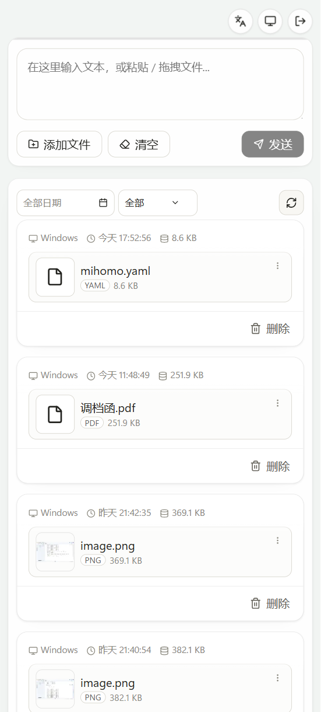

<p align="center"></p>
<h1 align="center">cf-drop</h1>
<p align="center">云端私有文件/文本投递箱</p>
<p align="center"><strong>中文</strong> | <a href="./README_en.md">English</a></p>

---

## 中文

### 项目简介

`cf-drop` 是一个部署在 Cloudflare Workers 上的轻量私有投递箱，支持文本与文件上传、记录查看、文件下载与分享，默认通过密码保护访问。
<table width="100%">
<tr>
<td>

</td>
<td>

</td>
</tr>
</table>

### 快速开始

前置要求：

- Node.js >= 20
- pnpm >= 9
- Cloudflare 账号（可创建 Worker / D1 / R2）

1. 安装依赖

```bash
pnpm install
```

2. 创建配置文件（必须）

```bash
# macOS / Linux
cp wrangler.toml.example wrangler.toml

# Windows PowerShell
Copy-Item wrangler.toml.example wrangler.toml
```

3. 创建 Cloudflare 资源

```bash
npx wrangler d1 create cf-drop
npx wrangler r2 bucket create cf-drop
```

4. 编辑 `wrangler.toml`

- 填写 `database_id`
- 确认 `bucket_name`
- 设置 `PASSWORD`（推荐改为 secret）

```bash
npx wrangler secret put PASSWORD
```

5. 本地开发与部署

```bash
# 同时启动 Worker + Web（依赖 wrangler.toml 存在且 main 已配置）
pnpm dev

# 仅启动前端
pnpm dev:web

# 构建前端
pnpm build

# 构建并部署 Worker
pnpm deploy
```

### Ubuntu / Debian 命令行使用（CLI）

项目内置了独立 CLI（`cfdrop`），可在命令行完成和网页端一致的核心操作：登录校验、上传文本/文件、列表分页、下载、删除。

1. 在仓库中安装并链接 CLI

```bash
pnpm install
pnpm --filter @cf-drop/cli link --global
```

2. 登录并保存配置

```bash
cfdrop login --server "https://your-worker.example.com" --password "your-password"
```

3. 常用命令

```bash
# 上传文本
cfdrop upload --message "hello from cli"

# 上传文本 + 文件
cfdrop upload --message "report" ./a.txt ./b.pdf

# 查看第 1 页记录
cfdrop list --page 1

# 以 JSON 输出记录
cfdrop list --page 1 --json

# 下载单个文件（按索引）
cfdrop download --slug "<slug>" --index 0 --out .

# 下载整条记录 tarball
cfdrop download --slug "<slug>" --tarball --out .

# 删除记录
cfdrop delete --id 123
```

4. 配置优先级

- 命令参数（如 `--server`、`--password`）
- 环境变量（`CFDROP_SERVER`、`CFDROP_PASSWORD`）
- 配置文件：`~/.config/cfdrop/config.json`

### 浏览器扩展


本地加载（Chrome / Edge）：

1. 打开 `chrome://extensions` 或 `edge://extensions`
2. 开启开发者模式
3. 点击“加载已解压的扩展程序”
4. 选择 `cf-drop/extension` 目录
